# Documento de Arquitectura de Solución — VertebraAI

**Proyecto:** VertebraAI — Segmentación Semántica de Columna Vertebral  
**Versión:** 1.0  
**Fecha:** 2026-05-20  
**Autor(es):** • Nicolas Garzon • Sandra Lancheros • Luis Felipe Millan • Andres Rincon • Juan Arenas
**Institución:** Maestría en Inteligencia Artificial (MaIA) — Universidad de los Andes  
**Estado:** Borrador

---

## Tabla de Contenido

1. [Siglas y Acrónimos](#1-siglas-y-acrónimos)
2. [Propósito](#2-propósito)
3. [Dominio de Negocio](#3-dominio-de-negocio)
4. [Dominio de Aplicaciones](#4-dominio-de-aplicaciones)
5. [Dominio de Tecnología](#5-dominio-de-tecnología)
6. [Referencias](#6-referencias)

---

## 1. Siglas y Acrónimos

| Sigla / Término | Descripción |
|---|---|
| API | Application Programming Interface |
| AWS | Amazon Web Services |
| CDN | Content Delivery Network |
| CF | CloudFront (servicio CDN de AWS) |
| CPU | Central Processing Unit |
| DICOM | Digital Imaging and Communications in Medicine |
| DI | Dependency Injection (Inyección de Dependencias) |
| DIP | Dependency Inversion Principle |
| Docker | Plataforma de contenedores de software |
| E2E | End-to-End (extremo a extremo) |
| EC2 | Elastic Compute Cloud (servicio de cómputo de AWS) |
| ECR | Elastic Container Registry (registro de imágenes Docker en AWS) |
| FastAPI | Framework web moderno para Python basado en ASGI |
| GPU | Graphics Processing Unit |
| IAM | Identity and Access Management (AWS) |
| IoU | Intersection over Union (métrica de segmentación) |
| JWT | JSON Web Token |
| MedSAM | Medical Segment Anything Model (fine-tuned SAM para imágenes médicas) |
| ML | Machine Learning |
| OA | Objetivo de Arquitectura |
| ON | Objetivo de Negocio |
| PNG | Portable Network Graphics |
| REST | Representational State Transfer |
| S3 | Simple Storage Service (almacenamiento de AWS) |
| SAM | Segment Anything Model (Meta AI) |
| SPA | Single Page Application |
| SOLID | Single Responsibility, Open/Closed, Liskov, Interface Segregation, Dependency Inversion |
| SFC | Serverless Function Container |
| UNet++ | Arquitectura de red neuronal para segmentación semántica (variante de U-Net) |

---

## 2. Propósito

Este documento describe la arquitectura de solución del sistema **VertebraAI**, una plataforma de inteligencia artificial para la segmentación semántica de vértebras en radiografías de columna vertebral. El sistema permite a profesionales médicos y académicos cargar imágenes radiológicas y obtener una segmentación automatizada de las 17 vértebras de la columna (T1–T12, L1–L5), junto con métricas de calidad y visualización interactiva.

Este documento va dirigido a equipos técnicos, evaluadores académicos de la Maestría en Inteligencia Artificial (MaIA) de la Universidad de los Andes, y cualquier colaborador que requiera entender el diseño arquitectónico de la solución.

### 2.1 Alcance del documento

Este documento cubre:

- La **arquitectura de la aplicación frontend** (React SPA) que permite la interacción con el sistema
- La **arquitectura del servicio backend** (FastAPI, arquitectura hexagonal) que expone las APIs de autenticación, análisis y exportación
- Los **modelos de IA** integrados en el backend: VertebraPrompt-Net + BoxRefiner +MedSAM ViT-B y UNet++ EfficientNet-B7
- La **infraestructura en la nube** (AWS) aprovisionada mediante Terraform: CloudFront, EC2 Spot, ECR, S3, Cognito e IAM
- Los **flujos E2E** de autenticación, análisis de rayos X y exportación de resultados
- Los **principios de arquitectura** que rigen el diseño de la solución
- La **configuración** de cada capa y sus variables clave

> **Proveedor de nube:** Amazon Web Services (AWS), región `us-east-1`

### 2.2 No se incluye en el alcance

- Pipeline de entrenamiento y experimentación de modelos de ML (notebooks Jupyter, MLflow, Databricks)
- Proceso de recolección y etiquetado del dataset de radiografías
- Integración con sistemas de información hospitalaria (HIS/RIS/PACS)
- Despliegue en múltiples regiones AWS
- Alta disponibilidad con múltiples instancias EC2

---

## 3. Dominio de Negocio

### 3.1 Objetivos de Negocio

| Identificador | Descripción del Objetivo | Cómo se impacta en la arquitectura |
|---|---|---|
| ON-001 | Automatizar la identificación y segmentación de vértebras en radiografías para reducir la carga diagnóstica manual | La arquitectura incorpora un pipeline de ML de múltiples etapas (VertebraPrompt-Net → BoxRefiner → MedSAM) que procesa imágenes de forma autónoma, retornando resultados en segundos |
| ON-002 | Proveer métricas de confianza cuantitativas (Dice, IoU, confianza por región) para asistir en la toma de decisiones clínicas y académicas | El servicio backend calcula y expone métricas estandarizadas por cada inferencia; la respuesta incluye métricas globales y por vértebra |
| ON-003 | Hacer la herramienta accesible vía web sin requerir instalación de software en el dispositivo del usuario | La SPA React se sirve desde CloudFront/S3 y funciona en cualquier navegador moderno; el procesamiento pesado ocurre en el servidor |
| ON-004 | Permitir la comparación entre múltiples modelos de segmentación para evaluación académica y experimental | El backend implementa un `ModelRegistry` que permite seleccionar el modelo en tiempo de ejecución; el usuario elige el modelo desde la interfaz |

### 3.2 Objetivos de Arquitectura

| Identificador | Descripción del Objetivo | Cómo se impacta |
|---|---|---|
| OA-001 | Modularidad y extensibilidad del pipeline de modelos de IA | Patrón Ports & Adapters: cada modelo es un adapter intercambiable; agregar un nuevo modelo no modifica el Use Case ni el Router |
| OA-002 | Separación clara de responsabilidades entre capa de presentación, lógica de negocio e infraestructura | Arquitectura hexagonal en el backend: Use Cases no dependen de FastAPI, ni de PyTorch, ni de Cognito directamente |
| OA-003 | Seguridad de acceso al endpoint de análisis | Autenticación con AWS Cognito (JWT IdToken); rate limiting con SlowAPI (5/min en `/xrays`); CORS configurable |
| OA-004 | Despliegue reproducible y declarativo de la infraestructura | Toda la infraestructura AWS está definida en Terraform; un `terraform apply` recrea el entorno completo |
| OA-005 | Facilidad de mantenimiento y prueba del backend | Arquitectura hexagonal permite pruebas unitarias sin GPU (los adapters pueden ser mockeados); cobertura objetivo ≥ 80% |
| OA-006 | Bajo costo operativo en entorno académico | EC2 Spot t3.large (ahorro ~60-70% vs on-demand); CloudFront + S3 para frontend (~$0 a escala académica) |

### 3.3 Análisis

**Domain-Driven Design (DDD)**

La solución se diseña alrededor del dominio de la segmentación vertebral. Las entidades centrales del dominio son:

- **`VertebraAnalysis`**: agregado raíz que representa el resultado completo de un análisis de radiografía (identificador único, lista de vértebras, métricas globales)
- **`Vertebra`**: entidad de valor que representa una vértebra individual (identificador como C3, T5, L2; región anatómica; estado de detección; confianza; bbox; centroide; pixel count)

El lenguaje ubicuo del dominio incluye términos como *vértebra*, *región cervical/torácica/lumbar*, *máscara de segmentación*, *bounding box*, *confianza de detección*.

**Ports & Adapters (Hexagonal Architecture)**

Los puertos abstractos (`ModelPort`, `StoragePort`, `AuthPort`) permiten que los Use Cases permanezcan agnósticos de la infraestructura concreta (PyTorch, InMemory, Cognito). Esto facilita la sustitución de tecnologías sin modificar la lógica de negocio.

### 3.4 Contexto Acotado (Bounded Context)

**Dominio Core:**
- Segmentación Vertebral: recibe imagen → ejecuta pipeline ML → retorna análisis con máscara y métricas
- Gestión de Análisis: almacena resultados temporalmente y permite exportarlos en múltiples formatos

**Dominios Genéricos:**
- Autenticación y Autorización: delegado a AWS Cognito (IdToken JWT)
- Almacenamiento de Resultados: InMemoryAdapter (en-proceso, temporal por sesión)
- Entrega de Contenido Estático: S3 + CloudFront

**Dominio de Soporte:**
- Exportación de Resultados: conversión de `VertebraAnalysis` a formatos descargables (PNG, mask, overlay, report JSON)
- Catálogo de Modelos: listado y descripción de los modelos disponibles con sus Model Cards

### 3.5 Distribución de Requerimientos

| Proceso | Fase 1 (Investigación) | Fase 2 (Servicio Backend) | Fase 3 (Frontend + Despliegue) |
|---|---|---|---|
| Recolección y preparación de datos | ✓ | | |
| Experimentación con modelos (UNet, UNet++, SAM) | ✓ | | |
| Pipeline final (VertebraPrompt + BoxRefiner + MedSAM) | ✓ | ✓ | |
| API REST (FastAPI, arquitectura hexagonal) | | ✓ | |
| Autenticación con Cognito | | ✓ | |
| SPA React (interfaz de usuario) | | | ✓ |
| Infraestructura Terraform (AWS) | | | ✓ |
| Despliegue en producción (CloudFront + EC2) | | | ✓ |

### 3.6 Procesos E2E

Esta sección describe los tres flujos principales de extremo a extremo, mostrando cómo la información atraviesa las capas de la arquitectura.

#### 3.6.1 Flujo E2E: Autenticación

El usuario ingresa credenciales en la SPA. El frontend invoca el endpoint de login del backend, que delega la validación a AWS Cognito. Al completarse exitosamente, el frontend almacena el JWT en memoria y habilita el panel de análisis.

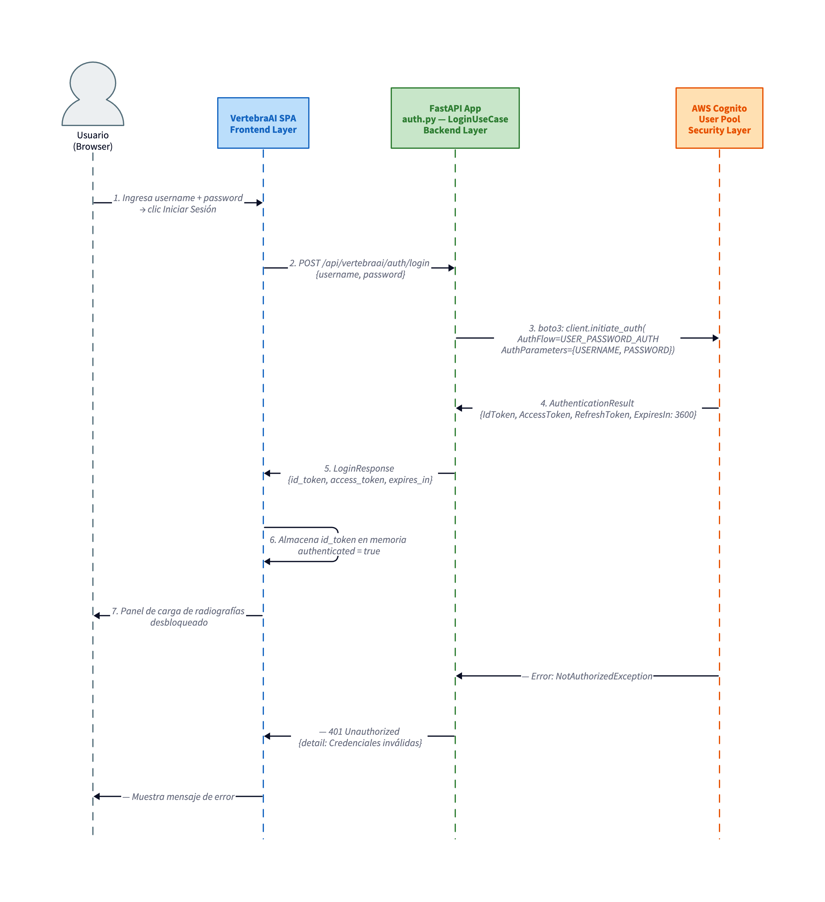

#### 3.6.2 Flujo E2E: Análisis de Rayos X

El usuario selecciona una imagen y un modelo. La SPA envía la imagen al backend (autenticado con JWT). El backend ejecuta el pipeline de segmentación de múltiples etapas (VertebraPrompt-Net → BoxRefiner → MedSAM ViT-B) y retorna la máscara coloreada, métricas y tabla de vértebras.

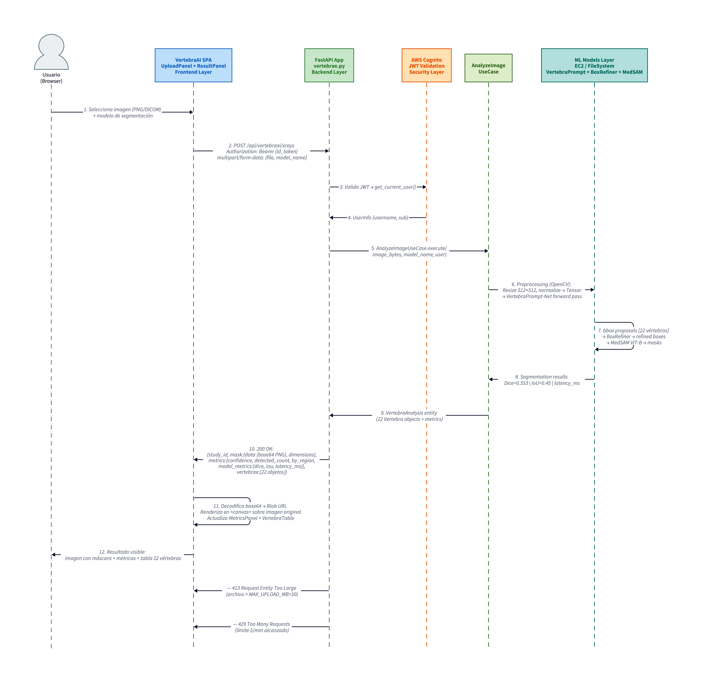

#### 3.6.3 Flujo E2E: Exportación de Resultados

El usuario solicita exportar el resultado de un análisis previo. El frontend invoca el endpoint de exportación con el formato deseado. El backend recupera el análisis del almacenamiento en memoria, convierte al formato solicitado y retorna el archivo para descarga directa.

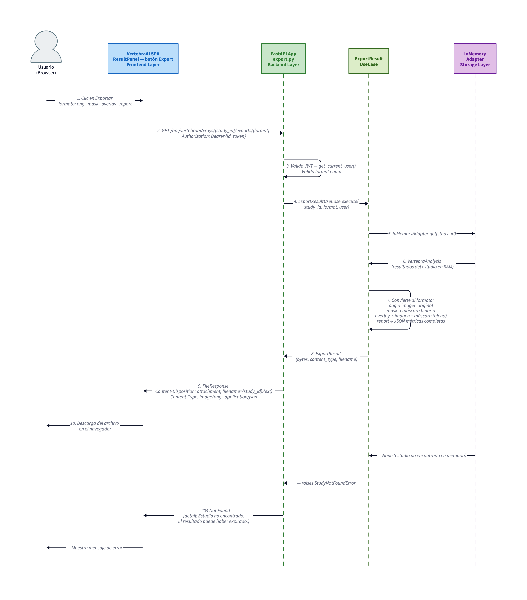

---

## 4. Dominio de Aplicaciones

### 4.1 Arquitectura de Alto Nivel

La solución se estructura en cuatro capas principales: Security Layer (Cognito), Frontend Layer (React SPA), Backend/Services Layer (FastAPI), y ML Models Layer (PyTorch en EC2). La siguiente figura ilustra la arquitectura de referencia de VertebraAI:

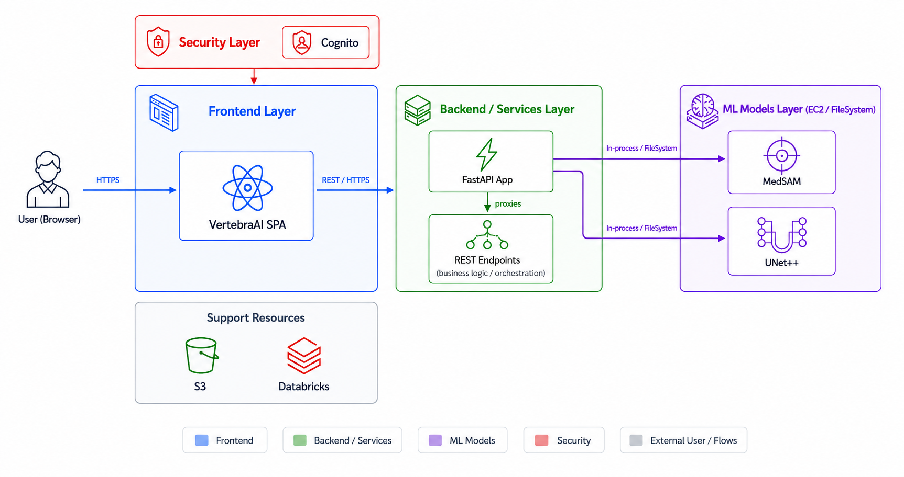

El usuario accede a la aplicación via HTTPS a través de **CloudFront**, que actúa como punto único de entrada:

- Las peticiones a `/*` son servidas desde el **bucket S3** que contiene los archivos estáticos del frontend (index.html, app.jsx, styles.css)
- Las peticiones a `/api/*` son enrutadas al **EC2 Spot** donde corre el contenedor Docker del backend FastAPI

La **autenticación** es gestionada por AWS Cognito, que emite JWT (IdToken) validados por el backend en cada petición autenticada (`AUTH_ENABLED=true` hardcodeado en `user_data.sh.tpl`). Los **pesos de los modelos ML** (~2 GB, checkpoints de VertebraPrompt-Net, BoxRefiner y MedSAM) se empaquetan dentro de la imagen Docker durante el `docker build` (`COPY model-pkg/ ./model-pkg/`) y llegan al EC2 a través de ECR vía `docker pull`. El bucket S3 `maia-proyecto-final-models` existe para distribución externa de checkpoints (acceso de solo lectura para colaboradores), pero **no interviene en el arranque del servicio**.

### 4.2 Principios de Arquitectura

#### 4.2.1 Arquitectura Hexagonal (Ports & Adapters)

El backend implementa el patrón de arquitectura hexagonal, garantizando que el núcleo de dominio (Use Cases + entidades) no dependa de ningún framework ni tecnología concreta. Las dependencias apuntan siempre hacia el centro:

- **Use Cases** dependen de interfaces abstractas (`ModelPort`, `StoragePort`, `AuthPort`)
- **Adapters** implementan esas interfaces y pueden ser sustituidos sin modificar el dominio
- **FastAPI Routers** son adaptadores de la capa de entrada (Driving Side)
- **Cognito, InMemory, PyTorch** son adaptadores de la capa de salida (Driven Side)

#### 4.2.2 Principios SOLID

| Principio | Aplicación en VertebraAI |
|---|---|
| **SRP** — Single Responsibility | Cada Use Case tiene una única responsabilidad (`AnalyzeImageUseCase`, `ExportResultUseCase`, `LoginUseCase`) |
| **OCP** — Open/Closed | El `ModelRegistry` permite agregar nuevos modelos (nuevos adapters) sin modificar código existente |
| **LSP** — Liskov Substitution | Cualquier adapter que implemente `ModelPort` puede sustituir a otro sin romper el contrato |
| **ISP** — Interface Segregation | `ModelPort`, `StoragePort` y `AuthPort` son interfaces pequeñas y específicas |
| **DIP** — Dependency Inversion | Los Use Cases dependen de abstracciones (ports), no de implementaciones concretas (Cognito, PyTorch) |

#### 4.2.3 Resiliencia y Rate Limiting

El backend implementa rate limiting con **SlowAPI**:
- **5 requests/minuto** en el endpoint de análisis (`POST /xrays`) — protege contra abuso del recurso de ML
- **120 requests/minuto** general — límite por IP configurable

El timeout de inferencia (`INFERENCE_TIMEOUT_S=60`) evita que peticiones bloqueadas consuman recursos indefinidamente.

#### 4.2.4 Separación de Configuración y Código

Toda la configuración del sistema es externalizable mediante variables de entorno (Pydantic `BaseSettings`). La infraestructura no requiere recompilación para cambiar parámetros de modelos, límites de tasa o credenciales de Cognito.

### 4.3 Componentes

#### 4.3.1 Capa Frontend

La capa frontend es una Single Page Application (SPA) desarrollada en React 18 que se sirve como archivos estáticos desde S3/CloudFront. No requiere proceso de build: utiliza React UMD y Babel Standalone cargados directamente desde CDN.

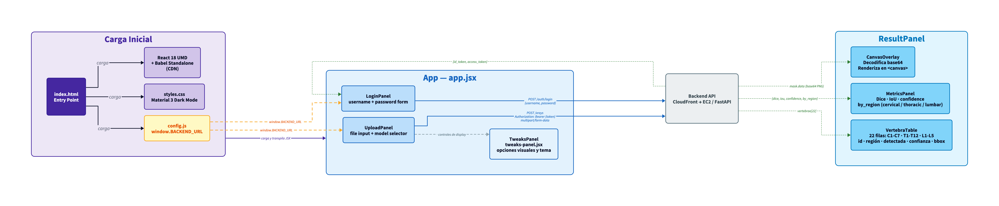

##### Descripción de componentes

| Componente | Archivo | Responsabilidad |
|---|---|---|
| `App` | `app.jsx` | Componente raíz; gestiona estado global: autenticación, estudio activo |
| `LoginPanel` | `app.jsx` | Formulario de usuario/contraseña; invoca `POST /auth/login`; almacena JWT en memoria |
| `UploadPanel` | `app.jsx` | Selector de imagen y modelo; construye `FormData`; invoca `POST /xrays` con JWT |
| `ResultPanel` | `app.jsx` | Orquesta la visualización del resultado; pasa datos a subcomponentes |
| `CanvasOverlay` | `app.jsx` | Decodifica mask.data (base64 PNG); renderiza en `<canvas>` sobre la imagen original |
| `MetricsPanel` | `app.jsx` | Muestra Dice, IoU, confianza global y detecciones por región anatómica |
| `VertebraTable` | `app.jsx` | Tabla de 22 filas con id, región, detectada, confianza y bounding box |
| `TweaksPanel` | `tweaks-panel.jsx` | Controles de visualización: tema, opacidad de máscara, opciones de display |
| `config.js` | `config.js` | Archivo generado por Terraform; expone `window.BACKEND_URL` al runtime |

##### Secuencia: Login desde el Frontend

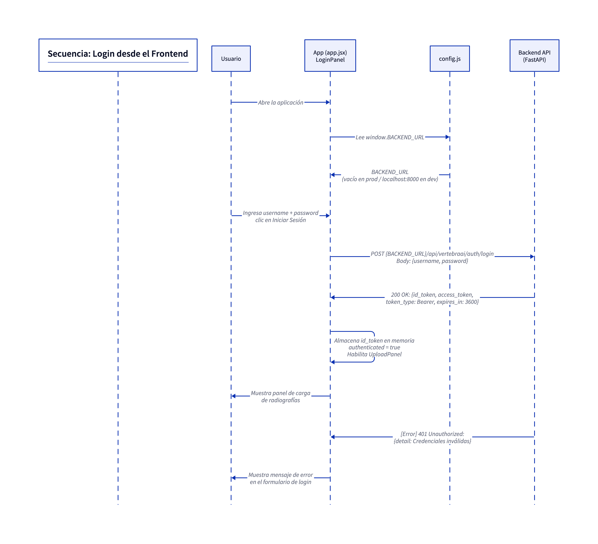

##### Secuencia: Upload y Análisis desde el Frontend

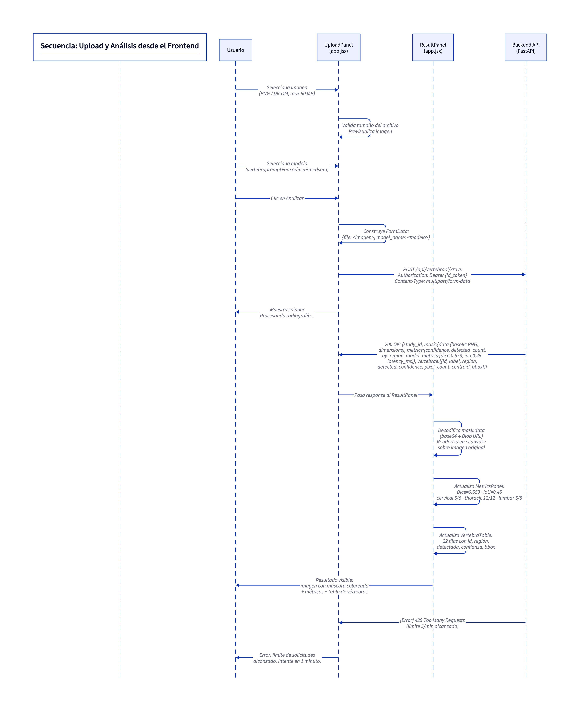

##### 🔧 Configuración Frontend

| Parámetro | Mecanismo | Descripción |
|---|---|---|
| `window.BACKEND_URL` | `config.js` generado por Terraform | URL base del backend. Vacío (`""`) en producción (CloudFront enruta `/api/*`). `http://localhost:8000` para desarrollo local |
| Puerto de desarrollo | `package.json` script `start` | `npx serve . -l 5500` — cambiar `-l` para usar otro puerto |
| Modelo de segmentación | Dropdown en `UploadPanel` | Valor enviado como `model_name` al backend; mapea al enum `ModelName` |
| Tamaño máximo de upload | Validación en `UploadPanel` | Controlado por el backend (`MAX_UPLOAD_MB`); el frontend valida antes de enviar |
| CORS | Configurado en backend | El frontend no gestiona CORS; depende de `CORS_ORIGINS` en el backend |

**Desarrollo local:**
```bash
cd frontend
# Editar o crear config.js manualmente:
# window.BACKEND_URL = "http://localhost:8000";
npx serve . -l 5500
# Backend debe estar corriendo en localhost:8000
```

---

#### 4.3.2 Capa Backend (FastAPI — Arquitectura Hexagonal)

El backend es un servicio FastAPI con arquitectura hexagonal (Ports & Adapters). El núcleo del dominio contiene los Use Cases y las entidades de dominio, rodeado de adapters que implementan la comunicación con sistemas externos (Cognito, PyTorch, almacenamiento en memoria).

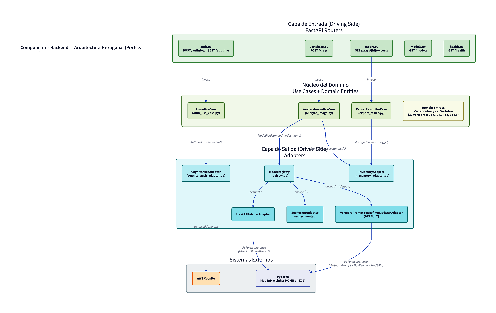

##### Descripción de componentes

**Capa de Entrada (Routers — FastAPI):**

| Router | Archivo | Endpoints | Rate Limit |
|---|---|---|---|
| `VertebraeRouter` | `vertebrae.py` | `POST /xrays` | 5/min |
| `AuthRouter` | `auth.py` | `POST /auth/login`, `POST /auth/logout`, `GET /auth/me` | 120/min |
| `ExportRouter` | `export.py` | `GET /xrays/{id}/exports/{format}` | 120/min |
| `ModelsRouter` | `models.py` | `GET /models`, `GET /models/{id}` | 120/min |
| `HealthRouter` | `health.py` | `GET /health` | Sin límite |

**Núcleo del Dominio (Use Cases):**

| Use Case | Archivo | Responsabilidad |
|---|---|---|
| `AnalyzeImageUseCase` | `analyze_image.py` | Orquesta el pipeline completo: valida entrada → selecciona adapter vía `ModelRegistry` → ejecuta inferencia → construye `VertebraAnalysis` |
| `ExportResultUseCase` | `export_result.py` | Recupera un análisis del almacenamiento y lo convierte al formato solicitado |
| `LoginUseCase` | `auth_use_case.py` | Autentica usuario con Cognito; retorna JWT |

**Entidades de Dominio:**

| Entidad | Atributos clave |
|---|---|
| `VertebraAnalysis` | `study_id`, `timestamp`, `mask`, `metrics` (`confidence`, `dice`, `iou`, `latency_ms`, `by_region`), `vertebrae[]` |
| `Vertebra` | `id` (ej: C3), `label`, `region` (cervical/thoracic/lumbar), `detected`, `confidence`, `pixel_count`, `centroid` {x,y}, `bounding_box` {x_min,y_min,x_max,y_max} |

**Adapters (Capa de Salida):**

| Adapter | Implementa | Descripción |
|---|---|---|
| `VertebraPromptBoxRefinerMedSAMAdapter` | `ModelPort` | Pipeline DEFAULT: VertebraPrompt-Net → BoxRefiner → MedSAM ViT-B (fine-tuned). Dice=0.553, IoU=0.45 |
| `UNetPPPatchesAdapter` | `ModelPort` | UNet++ EfficientNet-B7 con sliding window por patches |
| `SegFormerAdapter` | `ModelPort` | SegFormer experimental |
| `CognitoAuthAdapter` | `AuthPort` | Autentica vía boto3 `InitiateAuth`; valida JWT con `python-jose` |
| `InMemoryAdapter` | `StoragePort` | Almacena `VertebraAnalysis` en un diccionario en RAM (efímero por sesión) |

##### Secuencia: Autenticación con AWS Cognito

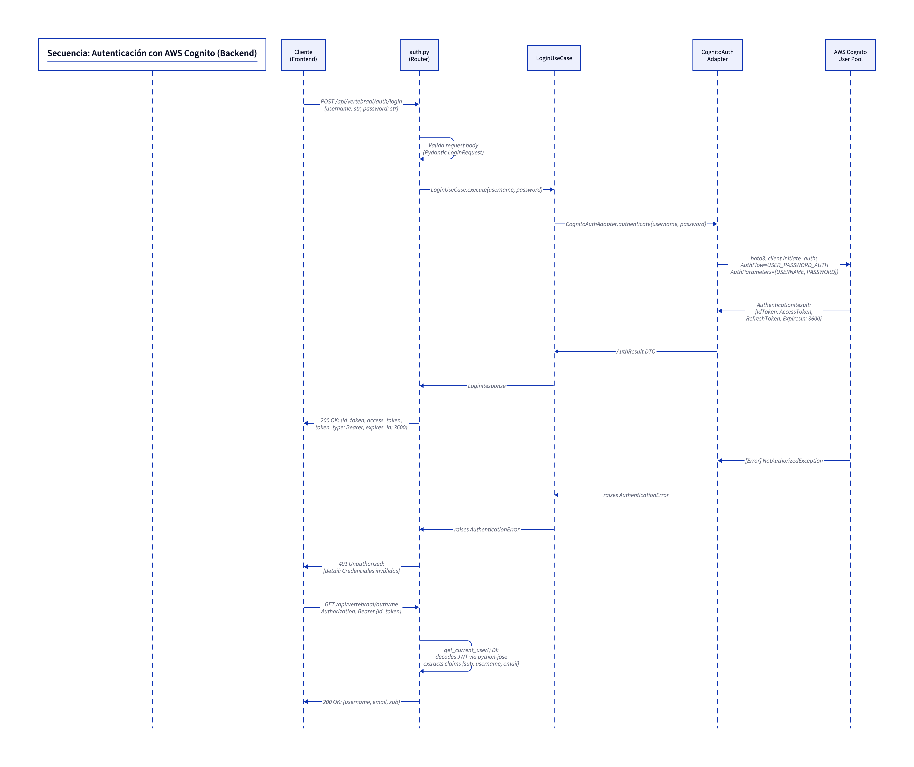

##### Secuencia: Pipeline de Segmentación

El pipeline de segmentación es el flujo más complejo del sistema. Involucra tres modelos ejecutados secuencialmente: VertebraPrompt-Net genera propuestas de bounding boxes para las 22 vértebras, BoxRefiner refina anatómicamente esas cajas, y MedSAM ViT-B genera la máscara de segmentación para cada caja.

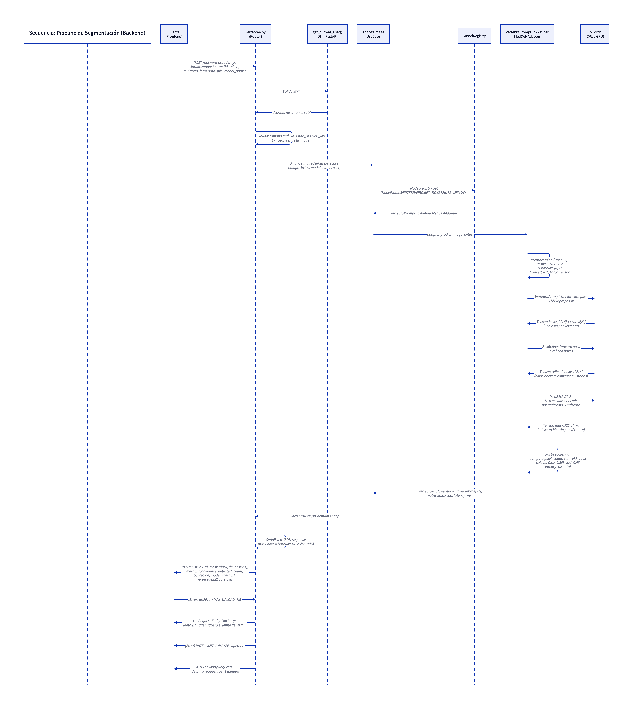

##### Secuencia: Exportación de Resultados

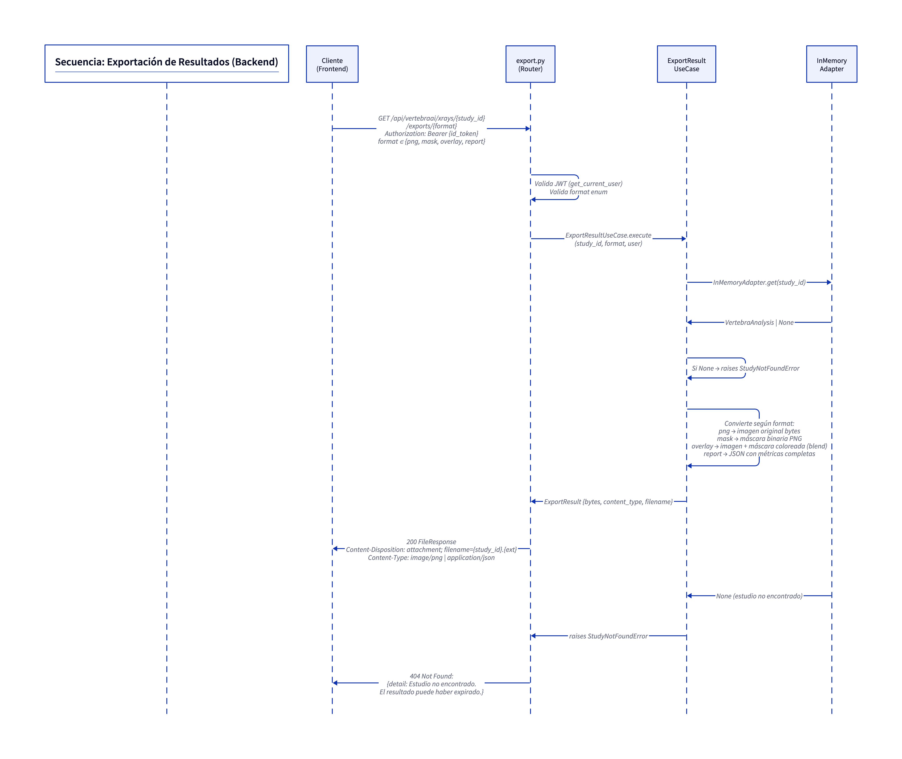

##### 🔧 Configuración Backend

Toda la configuración del backend se gestiona mediante variables de entorno (archivo `.env` o inyección en Docker). Gestionadas por Pydantic `BaseSettings` en [`config.py`](../../services/app/config.py).

> **Principio clave:** cualquier parámetro definido en `config.py` puede sobreescribirse **sin modificar el código**, declarándolo como variable de entorno o en el archivo `.env`. El orden de prioridad es: variable de entorno del sistema > `.env` > valor default en `config.py`. Solo es necesario declarar las variables que difieren del default.

**Servidor y API**

| Variable | Default | Descripción |
|---|---|---|
| `MODEL_DEVICE` | `cpu` | Dispositivo de inferencia: `cpu`, `cuda`, `mps` |
| `MODEL_INPUT_SIZE` | `512` | Resolución interna para preprocessing |
| `MAX_UPLOAD_MB` | `50` | Tamaño máximo de imagen para upload |
| `INFERENCE_TIMEOUT_S` | `60` | Timeout de inferencia en segundos |
| `CORS_ORIGINS` | `["*"]` | Lista JSON de orígenes permitidos |
| `RATE_LIMIT_DEFAULT` | `120/minute` | Rate limit general por IP |
| `RATE_LIMIT_ANALYZE` | `5/minute` | Rate limit para `POST /xrays` |
| `DEBUG` | `false` | Habilita Swagger UI y ReDoc |
| `PORT` | `8000` | Puerto del servidor Uvicorn |
| `AUTH_ENABLED` | `true` | Valida JWT Cognito. Poner `false` para dev local sin Cognito |

**Checkpoints e hiperparámetros — Pipeline MedSAM (VertebraPrompt-Net + BoxRefiner + MedSAM)**

Los valores default corresponden al pipeline ganador (notebook 06). Solo se deben declarar en `.env` para experimentación.

| Variable | Default | Descripción |
|---|---|---|
| `MEDSAM_PROMPT_NET_CHECKPOINT` | `model-pkg/medsam/vertebraprompt_net_auxiliar_best.pt` | Checkpoint VertebraPrompt-Net |
| `MEDSAM_BOX_REFINER_CHECKPOINT` | `model-pkg/medsam/box_refiner_best.pt` | Checkpoint BoxRefiner |
| `MEDSAM_SAM_CHECKPOINT` | `model-pkg/medsam/medsam_vit_b.pth` | Checkpoint SAM ViT-B base |
| `MEDSAM_FINETUNED_CHECKPOINT` | `model-pkg/medsam/medsam_decoder_encoder_parcial_entrenado_vertebraprompt_aux.pt` | Checkpoint MedSAM fine-tuned |
| `MEDSAM_PROMPT_NET_INPUT` | `512` | Resolución de entrada VertebraPrompt-Net |
| `MEDSAM_IMG_SIZE` | `1024` | Resolución de grilla MedSAM y letterbox |
| `MEDSAM_BASE_CHANNELS` | `32` | Canales base U-Net multi-tarea |
| `MEDSAM_N_CLASSES` | `17` | Clases predichas (T1..T12 + L1..L5) |
| `MEDSAM_TOP_PEAKS` | `90` | Máximo de picos del heatmap |
| `MEDSAM_MIN_PEAK_DIST` | `8` | Distancia mínima entre picos (NMS) |
| `MEDSAM_THR_REL_PEAKS` | `0.12` | Umbral relativo al máximo del heatmap |
| `MEDSAM_N_BOXES_PATH` | `17` | Pasos de la programación dinámica |
| `MEDSAM_MAX_CANDIDATES` | `120` | Candidatos máximos a la DP |
| `MEDSAM_MAX_GAP_REL_DY` | `2.40` | Multiplicador del gap esperado en DP |
| `MEDSAM_Y_MIN_ANATOMIC_MARGIN` | `0.06` | Margen superior de exclusión de cráneo |
| `MEDSAM_SKULL_SCORE_FACTOR` | `0.12` | Penalización de score en zona cráneo |
| `MEDSAM_BOX_EXPAND_W` | `1.12` | Expansión horizontal caja final |
| `MEDSAM_BOX_EXPAND_H` | `1.12` | Expansión vertical caja final |
| `MEDSAM_WH_PRED_BLEND` | `0.65` | Peso de la predicción wh-map |
| `MEDSAM_WH_TEMPLATE_BLEND` | `0.35` | Peso de la plantilla mediana |
| `MEDSAM_WH_CLIP_W` | `[0.03, 0.28]` | Límites `[min, max]` de w_rel (JSON) |
| `MEDSAM_WH_CLIP_H` | `[0.025, 0.18]` | Límites `[min, max]` de h_rel (JSON) |
| `MEDSAM_BOX_REFINER_SIZE` | `192` | Resolución crop de entrada al refinador |
| `MEDSAM_BOX_REFINER_BLEND` | `0.80` | Factor de mezcla al aplicar deltas |
| `MEDSAM_BOX_REFINER_MAX_ABS_DXY` | `0.45` | Saturación tanh desplazamientos dx, dy |
| `MEDSAM_BOX_REFINER_MAX_ABS_LOG_SCALE` | `0.45` | Saturación tanh escala log dw, dh |
| `MEDSAM_BOX_REFINER_CONTEXT_FRAC` | `0.85` | Contexto extra en el crop de refinamiento |
| `MEDSAM_N_SERVICE_CLASSES` | `23` | Clases contrato del servicio (bg + C1..C7 + T1..T12 + L1..L5) |

**Checkpoints e hiperparámetros — UNet++ EfficientNet-B7 (ventana deslizante)**

Los valores default son los hiperparámetros ganadores del barrido (notebook `Unet++_patches.ipynb`, celdas 30–32, Dice test 0.4711). Solo se deben declarar en `.env` para experimentación.

| Variable | Default | Descripción |
|---|---|---|
| `UNETPP_PATCHES_CHECKPOINT` | `model-pkg/unet++_patches/unet++_patches.pth` | Pesos del modelo |
| `UNETPP_ENCODER_NAME` | `efficientnet-b7` | Backbone encoder |
| `UNETPP_IN_CHANNELS` | `3` | Canales de entrada (RGB) |
| `UNETPP_NUM_MODEL_CLASSES` | `18` | Clases emitidas (bg + T1..T12 + L1..L5) |
| `UNETPP_PATCH_SIZE` | `128` | Resolución de cada parche antes de inferencia |
| `UNETPP_MEAN` | `[0.485, 0.456, 0.406]` | Media de normalización ImageNet (JSON) |
| `UNETPP_STD` | `[0.229, 0.224, 0.225]` | Desviación estándar ImageNet (JSON) |
| `UNETPP_CLAHE_CLIP` | `2.0` | `clipLimit` del preprocesado CLAHE |
| `UNETPP_CLAHE_TILE` | `[8, 8]` | `tileGridSize` del preprocesado CLAHE (JSON) |
| `UNETPP_PATCH_AREA` | `0.5` | Fracción del área total para el tamaño de ventana |
| `UNETPP_SIGMA` | `50.0` | Sigma de la ventana gaussiana de fusión |
| `UNETPP_STRIDE_RATIO` | `4` | Divisor del tamaño de parche para calcular stride |
| `UNETPP_N_SERVICE_CLASSES` | `23` | Clases del contrato del servicio (incluyendo cervicales) |
| `UNETPP_FIRST_VERTEBRA_ID` | `6` | ID de servicio de T1 (contrato `vertebra.ID2LABEL`) |
| `UNETPP_LAST_VERTEBRA_ID` | `22` | ID de servicio de L5 |

**Autenticación (AWS Cognito)** — solo cuando `AUTH_ENABLED=true`

| Variable | Default | Descripción |
|---|---|---|
| `COGNITO_USER_POOL_ID` | — | ID del User Pool (requerido en producción) |
| `COGNITO_CLIENT_ID` | — | ID del App Client (requerido en producción) |
| `COGNITO_REGION` | `us-east-1` | Región AWS del User Pool |

**Ejecución local:**
```bash
cd services
cp .env.example .env
# Editar .env con valores de Cognito y paths de modelos
uvicorn app.main:app --reload --port 8000

# Con Docker:
docker build -t vertebraai .
docker run -p 8000:8000 \
  -v /path/to/model-pkg:/app/model-pkg:ro \
  --env-file .env \
  vertebraai
```

---

#### 4.3.3 Capa Infraestructura / AWS

La infraestructura de VertebraAI se aprovisiona completamente mediante Terraform (IaC), garantizando reproducibilidad y consistencia entre entornos.

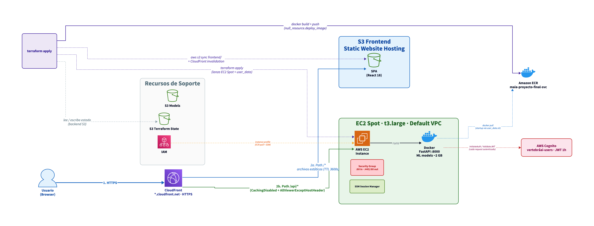

##### Descripción de recursos Terraform

| Recurso AWS | Nombre / Tipo | Propósito |
|---|---|---|
| **S3 Bucket** | `anferiro-maia-proyecto-final-frontend` | Hosting estático del frontend SPA (index.html, app.jsx, styles.css) |
| **S3 Bucket** | `anferiro-maia-proyecto-final-state` | Backend remoto de Terraform (estado de infraestructura) |
| **S3 Bucket** | `maia-proyecto-final-models` | Distribución externa de checkpoints ML (~2 GB). Acceso de solo lectura vía IAM user `models-reader`. **No se usa en el arranque del EC2** — los pesos van empaquetados en la imagen Docker. |
| **CloudFront** | Distribución auto-nombrada | CDN HTTPS; enruta `/*` a S3 y `/api/*` a EC2; cache de archivos estáticos |
| **EC2 Spot** | `t3.large` (2 vCPU / 8 GB RAM) | Ejecuta el contenedor Docker del backend FastAPI |
| **ECR** | `maia-proyecto-final-svc` | Registro privado de la imagen Docker del servicio |
| **Security Group** | Auto-creado | Reglas de firewall: permite puertos 80/443 inbound |
| **IAM Role** | `maia-proyecto-grado` | Rol asignado al EC2: permite `ecr:GetDownloadUrlForLayer` / `ecr:BatchGetImage` para hacer `docker pull` desde ECR |
| **Cognito UserPool** | `vertebraai` | Gestión de usuarios y emisión de JWT (IdToken, AccessToken) |
| **Cognito App Client** | Auto-creado | Cliente de la aplicación para autenticación USER_PASSWORD_AUTH |

##### Archivos Terraform clave

| Archivo | Responsabilidad |
|---|---|
| `providers.tf` | Configuración del proveedor AWS y backend S3 |
| `variables.tf` | Variables de entrada del módulo |
| `outputs.tf` | Outputs: URL CloudFront, health check, ECR URL, Cognito IDs |
| `s3_frontend.tf` | Bucket frontend + política pública + provisioner `aws s3 sync` + generador `config.js` |
| `s3_models.tf` | Bucket de modelos + usuario IAM de solo lectura para distribución |
| `services_ec2.tf` | EC2 Spot + ECR + security groups + Docker build/push + user_data |
| `cloudfront.tf` | Distribución CloudFront + políticas de caché + grupos de origen |
| `iam.tf` | IAM Role + instance profile + permisos ECR y S3 |
| `cognito.tf` | User Pool + App Client + usuario admin inicial |
| `user_data.sh.tpl` | Script de inicio EC2: `docker pull` + `docker run` con variables de entorno |

##### Secuencia: Deployment Flow

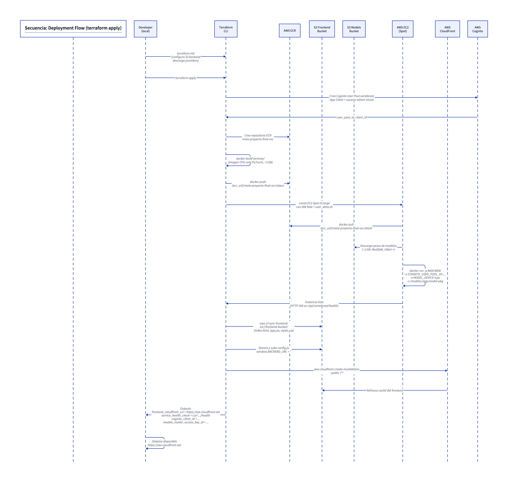

##### 🔧 Configuración Infraestructura

La configuración de la infraestructura se gestiona mediante el archivo `terraform.tfvars`:

| Variable Terraform | Tipo | Descripción |
|---|---|---|
| `aws_region` | `string` | Región de despliegue (default: `us-east-1`) |
| `instance_type` | `string` | Tipo de instancia EC2 (default: `t3.large`) |
| `frontend_bucket_name` | `string` | Nombre del bucket S3 para el frontend |
| `models_bucket_name` | `string` | Nombre del bucket S3 para pesos de modelos |
| `cognito_admin_email` | `string` | Email del usuario administrador inicial en Cognito |
| `ecr_repository_name` | `string` | Nombre del repositorio ECR |

**Outputs disponibles post-despliegue:**

```bash
terraform output frontend_cloudfront_url     # URL HTTPS de la aplicación
terraform output service_health_check        # Comando curl para verificar el backend
terraform output ecr_repository_url          # URL del repositorio Docker
terraform output cognito_client_id           # Para configurar variables de entorno
terraform output models_reader_access_key_id # Credenciales de solo lectura para modelos
terraform output -raw models_reader_secret_key
```

**Secuencia de despliegue inicial:**
```bash
cd terraform
cp terraform.tfvars.example terraform.tfvars
# Editar terraform.tfvars con valores específicos
terraform init
terraform apply -target=aws_s3_bucket.tfstate   # Crea bucket de estado primero
# Descomentar backend "s3" en providers.tf
terraform init -migrate-state                    # Migra estado a S3
terraform plan
terraform apply                                  # Crea toda la infraestructura
```

---

### 4.4 Catálogo de Servicios

#### 4.4.1 Autenticación

| URL Base | Endpoint | Método | Auth | Descripción |
|---|---|---|---|---|
| `/api/vertebraai` | `/auth/login` | POST | No | Autentica usuario; retorna JWT |
| `/api/vertebraai` | `/auth/logout` | POST | No | Revoca sesión en Cognito |
| `/api/vertebraai` | `/auth/me` | GET | JWT | Retorna información del usuario autenticado |

**POST /auth/login — Datos de Entrada:**

| Atributo | Tipo | Obligatorio | Descripción |
|---|---|---|---|
| `username` | `string` | Sí | Nombre de usuario en Cognito |
| `password` | `string` | Sí | Contraseña del usuario |

**POST /auth/login — Datos de Salida (200 OK):**

| Atributo | Tipo | Descripción |
|---|---|---|
| `id_token` | `string` | JWT para autenticar llamadas a la API |
| `access_token` | `string` | Access token de Cognito |
| `token_type` | `string` | Siempre `"Bearer"` |
| `expires_in` | `integer` | Segundos hasta expiración (3600) |

#### 4.4.2 Análisis de Radiografías

| URL Base | Endpoint | Método | Auth | Descripción |
|---|---|---|---|---|
| `/api/vertebraai` | `/xrays` | POST | JWT | Analiza una radiografía y retorna segmentación |

**POST /xrays — Datos de Entrada (multipart/form-data):**

| Atributo | Tipo | Obligatorio | Descripción |
|---|---|---|---|
| `file` | `UploadFile` | Sí | Imagen radiológica (PNG, JPEG, DICOM) |
| `model_name` | `string` | No | Nombre del modelo (default: `vertebraprompt+boxrefiner+medsam-vit-b`) |

**POST /xrays — Datos de Salida (200 OK):**

| Atributo | Tipo | Descripción |
|---|---|---|
| `study_id` | `string` (UUID) | Identificador único del estudio |
| `timestamp` | `datetime` | Timestamp de procesamiento |
| `mask.data` | `string` (base64 PNG) | Máscara coloreada de segmentación |
| `mask.dimensions` | `object` | `{width, height}` de la máscara |
| `metrics.confidence` | `float` | Confianza global de detección [0, 1] |
| `metrics.detected_count` | `integer` | Número de vértebras detectadas (max 22) |
| `metrics.by_region` | `object` | Detecciones por región: `{cervical, thoracic, lumbar}` |
| `metrics.model_metrics.dice` | `float` | Coeficiente Dice (similitud con ground truth) |
| `metrics.model_metrics.iou` | `float` | Intersection over Union |
| `metrics.model_metrics.latency_ms` | `integer` | Latencia de inferencia en ms |
| `vertebrae` | `array[Vertebra]` | Lista de 22 objetos vértebra |
| `vertebrae[].id` | `string` | Identificador (ej: `"C3"`, `"T5"`, `"L2"`) |
| `vertebrae[].region` | `string` | `"cervical"`, `"thoracic"` o `"lumbar"` |
| `vertebrae[].detected` | `boolean` | Si la vértebra fue detectada |
| `vertebrae[].confidence` | `float` | Confianza individual [0, 1] |
| `vertebrae[].pixel_count` | `integer` | Número de píxeles en la máscara |
| `vertebrae[].centroid` | `object` | `{x, y}` del centroide |
| `vertebrae[].bounding_box` | `object` | `{x_min, y_min, x_max, y_max}` |

#### 4.4.3 Exportación

| URL Base | Endpoint | Método | Auth | Descripción |
|---|---|---|---|---|
| `/api/vertebraai` | `/xrays/{study_id}/exports/{format}` | GET | JWT | Exporta resultado en el formato indicado |

**GET /xrays/{study_id}/exports/{format} — Parámetros de Path:**

| Atributo | Tipo | Valores | Descripción |
|---|---|---|---|
| `study_id` | `string` (UUID) | — | Identificador del estudio previo |
| `format` | `string` | `png`, `mask`, `overlay`, `report` | Formato de exportación |

**GET /xrays/{...}/exports/{format} — Datos de Salida:**

| Format | Content-Type | Descripción |
|---|---|---|
| `png` | `image/png` | Imagen radiológica original |
| `mask` | `image/png` | Máscara binaria de segmentación |
| `overlay` | `image/png` | Imagen original con máscara coloreada superpuesta |
| `report` | `application/json` | JSON completo con todas las métricas y datos de vértebras |

#### 4.4.4 Modelos y Estado

| URL Base | Endpoint | Método | Auth | Descripción |
|---|---|---|---|---|
| `/api/vertebraai` | `/models` | GET | No | Lista modelos disponibles con Model Cards |
| `/api/vertebraai` | `/models/{model_id}` | GET | No | Detalle de un modelo específico |
| `/api/vertebraai` | `/health` | GET | No | Estado del servicio y modelos cargados |

### 4.5 Catálogo de Bases de Datos

| Componente | Tipo de Almacenamiento | Justificación |
|---|---|---|
| `InMemoryAdapter` | Diccionario en memoria (RAM) | Apropiado para el alcance académico del proyecto: los resultados de análisis son efímeros por sesión; no se requiere persistencia entre reinicios del servicio. Evita la complejidad operativa de una base de datos gestionada. |
| AWS Cognito | Managed Identity Store (servicio AWS) | Almacena usuarios, credenciales (hasheadas) y sesiones. Servicio gestionado que elimina la necesidad de implementar gestión de identidades. |

**Evolución futura:** En un contexto productivo, el `InMemoryAdapter` debería sustituirse por un adapter de `DynamoDB` o `Redis` (implementando el mismo `StoragePort`) para:
- Persistencia de resultados entre reinicios
- Soporte multi-instancia
- TTL configurable por estudio

---

## 5. Dominio de Tecnología

### 5.1 Arquitectura de Infraestructura

#### 5.1.1 Arquitectura Frontend

El frontend se despliega como archivos estáticos en **S3** con hosting web habilitado. **CloudFront** actúa como CDN distribuyendo el contenido globalmente con HTTPS. El archivo `config.js` es generado automáticamente por Terraform al momento del despliegue, inyectando la URL del backend como variable global.

**Flujo de request:**
1. Usuario accede a `https://{cloudfront_domain}/`
2. CloudFront sirve `index.html` desde S3 (caché si disponible)
3. El navegador carga `app.jsx`, `config.js`, `styles.css` vía CloudFront/S3
4. `config.js` establece `window.BACKEND_URL = ""` (relativo, CloudFront enruta `/api/*`)

#### 5.1.2 Arquitectura Backend

El backend corre en un **EC2 Spot t3.large** dentro de un contenedor Docker. El proceso de inicio (`user_data.sh.tpl`) hace únicamente `docker pull` desde **ECR** y lanza el contenedor — los pesos de los modelos ML viajan dentro de la imagen (empaquetados en el `docker build` vía `COPY model-pkg/`). No se descarga nada desde S3 en el arranque.

**No se usa ALB/NLB:** CloudFront apunta directamente a la IP del EC2. Si el Spot es reclamado, un nuevo `terraform apply` lanza una instancia con nueva IP y actualiza la distribución CloudFront.

**Configuración del contenedor en producción:**
```bash
docker run -d -p 8000:8000 \
  -e MODEL_DEVICE=cpu \
  -e COGNITO_USER_POOL_ID=${var.cognito_pool_id} \
  -e COGNITO_CLIENT_ID=${var.cognito_client_id} \
  -e COGNITO_REGION=us-east-1 \
  -e DEBUG=false \
  -v /opt/model-pkg:/app/model-pkg:ro \
  ${ecr_url}/maia-proyecto-final-svc:latest
```

#### 5.1.3 Trazabilidad y Observabilidad

En la versión actual (académica), la observabilidad se limita a:
- **Logs de aplicación:** FastAPI + Uvicorn escriben a stdout; capturados por Docker (`docker logs`)
- **Health check:** `GET /api/vertebraai/health` retorna estado de carga de modelos y disponibilidad del servicio
- **CloudWatch:** AWS captura logs básicos de EC2 por defecto

**Evolución futura:** Integración con CloudWatch Logs, métricas de latencia de inferencia, alertas de tasa de error.

#### 5.1.4 Autenticación y Autorización

AWS Cognito gestiona el ciclo de vida de las sesiones:
- `POST /auth/login` → `InitiateAuth` (USER_PASSWORD_AUTH) → `IdToken` (JWT)
- El `IdToken` se valida en cada petición autenticada mediante `python-jose` (verifica firma, expiración y claims)
- El `IdToken` expira en 3600 segundos; no se implementa renovación automática en esta versión

### 5.2 Stack Tecnológico

| Capa | Tecnología | Versión | Rol |
|---|---|---|---|
| **Frontend** | React | 18 (UMD) | Framework UI, gestión de estado |
| **Frontend** | Babel Standalone | Latest CDN | Transpilación JSX en el navegador |
| **Frontend** | Material 3 CSS | Custom | Sistema de diseño (dark mode) |
| **Backend** | Python | 3.11+ | Lenguaje principal del servicio |
| **Backend** | FastAPI | 0.111+ | Framework web ASGI |
| **Backend** | Uvicorn | 0.30+ | Servidor ASGI |
| **Backend** | Pydantic v2 | 2.x | Validación de requests/responses y configuración |
| **Backend** | SlowAPI | Latest | Rate limiting por IP |
| **Backend** | python-jose | Latest | Validación y decodificación de JWT |
| **ML** | PyTorch | 2.1+ | Framework de deep learning (CPU build) |
| **ML** | Transformers (HF) | Latest | Carga de modelos pre-entrenados |
| **ML** | OpenCV (headless) | Latest | Preprocessing de imágenes |
| **ML** | Albumentations | Latest | Augmentaciones y transformaciones |
| **ML** | NumPy, Pillow | Latest | Manipulación de arrays e imágenes |
| **Auth** | AWS Cognito | Managed | Gestión de identidades y JWT |
| **Auth** | boto3 | Latest | SDK AWS para Python |
| **Storage** | InMemory (dict) | — | Almacenamiento temporal de resultados |
| **Contenedores** | Docker | 24+ | Containerización del servicio |
| **IaC** | Terraform | 1.5+ | Provisioning declarativo de infraestructura |
| **CDN** | AWS CloudFront | Managed | Distribución de contenido + proxy de API |
| **Cómputo** | AWS EC2 Spot | t3.large | Ejecución del contenedor del servicio |
| **Registry** | AWS ECR | Managed | Registro privado de imágenes Docker |
| **Object Store** | AWS S3 | Managed | Frontend estático + pesos de modelos |
| **Testing** | pytest | 7+ | Framework de pruebas unitarias |
| **Testing** | pytest-asyncio | Latest | Soporte async en tests |
| **Testing** | httpx | Latest | Cliente HTTP para tests de integración |
| **Testing** | pytest-cov | Latest | Cobertura de código (objetivo ≥ 80%) |

---

## 6. Referencias

- **C4 Model (Arquitectura de Software):** Brown, Simon — https://c4model.com
- **Hexagonal Architecture:** Cockburn, Alistair — *"Hexagonal Architecture"* (2005)
- **SOLID Principles:** Martin, Robert C. — *"Clean Architecture: A Craftsman's Guide to Software Structure and Design"*, Prentice Hall, 2017
- **Domain-Driven Design:** Evans, Eric — *"Domain-Driven Design: Tackling Complexity in the Heart of Software"*, Addison-Wesley, 2003
- **FastAPI Documentation:** https://fastapi.tiangolo.com
- **MedSAM (Medical Segment Anything Model):** Ma et al. — *"Segment Anything in Medical Images"*, Nature Communications, 2024
- **Segment Anything Model (SAM):** Kirillov et al. (Meta AI) — *"Segment Anything"*, ICCV 2023
- **AWS Well-Architected Framework:** https://aws.amazon.com/architecture/well-architected/
- **Terraform AWS Provider:** https://registry.terraform.io/providers/hashicorp/aws/latest
- **D2Lang (Diagramas):** https://d2lang.com
- **OpenAPI 3.0 Specification:** `services/openapi/vertebraAI.yml`
- **Arquitectura de Referencia VertebraAI:** `docs/vertebraai/img/arquitectura_referencia_v0.1.2.png`
- **MLflow Experiment:** `https://dbc-250dea69-0463.cloud.databricks.com` — `/Users/anferiro@gmail.com/columna-vertebral-medsam`

---

*Documento generado como parte del proyecto de grado de la Maestría en Inteligencia Artificial (MaIA), Universidad de los Andes — 2026.*
