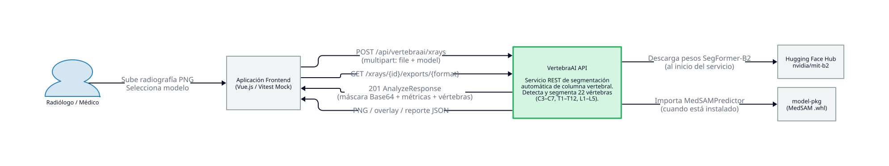
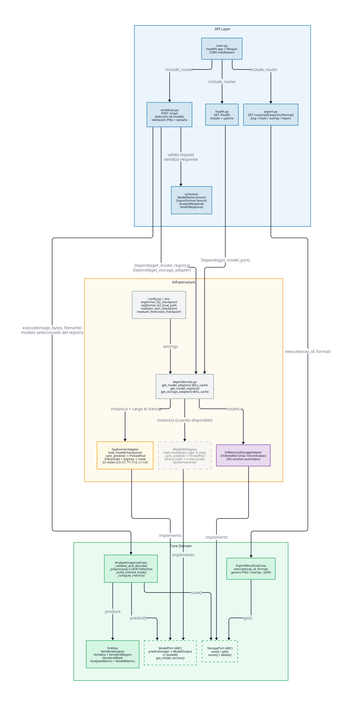
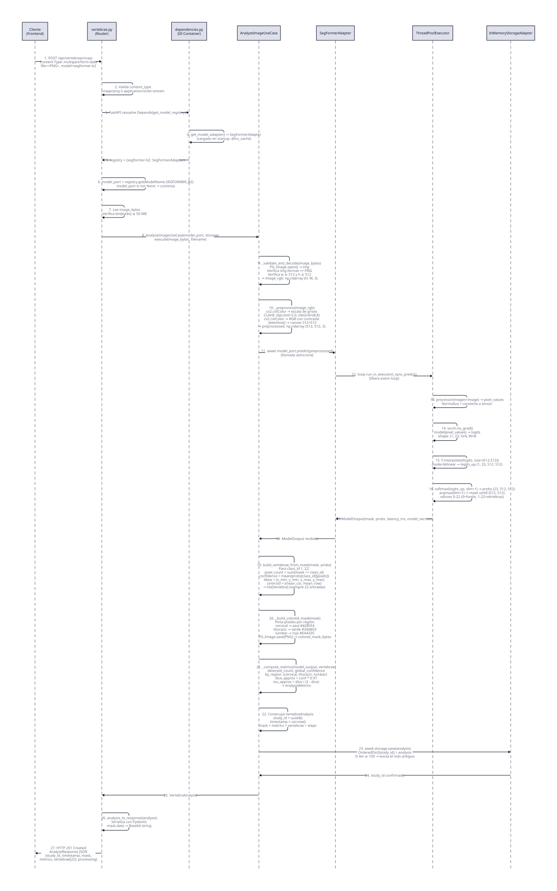

# Arquitectura VertebraAI — Documentación Técnica

> Proyecto de Grado **MaIA — Universidad de los Andes, 2026**  
> Servicio REST de segmentación automática de columna vertebral en radiografías.

---

## Tabla de Contenidos

1. [Arquitectura de Referencia](#1-arquitectura-de-referencia)
2. [Componentes](#2-componentes)
3. [Flujos](#3-flujos)

---

## 1. Arquitectura de Referencia

### Diagrama de Contexto (C4 Level 1)



### Descripción General

**VertebraAI** es un servicio REST construido con **FastAPI** que recibe radiografías de columna vertebral en formato PNG o JPEG, ejecuta un modelo de segmentación semántica seleccionado por el cliente y retorna una máscara coloreada con métricas por vértebra. Cada adapter es responsable de su propio preprocesamiento; el use case únicamente valida y decodifica la imagen cruda.

El sistema soporta múltiples modelos de segmentación seleccionables en cada request mediante un parámetro `model`. Los modelos disponibles se registran en el `ModelRegistry` del servicio.

### Actores y Sistemas Externos

| Actor / Sistema | Tipo | Rol |
|---|---|---|
| **Radiólogo / Médico** | Usuario | Sube radiografías y consulta resultados vía el frontend |
| **Aplicación Frontend** | Sistema externo | Interfaz web que consume la API REST |
| **Google Drive** | Sistema externo | Almacenamiento de checkpoints del pipeline MedSAM (`vertebraprompt_net`, `box_refiner`, `medsam_finetuned`) |
| **model-pkg (.whl)** | Paquete externo | Wheel de MedSAM fine-tuneado (segmentación binaria), instalable como dependencia opcional |

### Endpoints Públicos

| Método | Ruta | Descripción |
|---|---|---|
| `POST` | `/api/vertebraai/xrays` | Analiza una radiografía y retorna máscara + métricas |
| `GET` | `/api/vertebraai/health` | Estado del servicio y del modelo activo |
| `GET` | `/api/vertebraai/models` | Catálogo de modelos disponibles (Model Cards) |
| `POST` | `/api/vertebraai/auth/login` | Autenticar usuario con username + password → JWT IdToken |
| `POST` | `/api/vertebraai/auth/logout` | Revocar sesión (global sign-out en Cognito) |
| `GET` | `/api/vertebraai/auth/me` | Datos del usuario autenticado (requiere Bearer token) |
| `GET` | `/api/vertebraai/models/{model_id}` | Detalle de un Model Card específico |
| `GET` | `/api/vertebraai/xrays/{id}/exports/{format}` | Descarga el resultado en `png`, `mask`, `overlay` o `report` (requiere Bearer token) |

### Parámetro de Selección de Modelo

El endpoint POST acepta un campo de formulario opcional `model` que determina el modelo de segmentación:

| Valor | Modelo | Estado |
|---|---|---|
| `medsam` _(por defecto)_ | VertebraPrompt-Net + BoxRefiner + MedSAM ViT-B fine-tuned | Disponible |
| `unetpp-patches` | UNet++ encoder efficientnet-b7, ventana deslizante 128×128 (Dice test 0.4711) | Disponible |

---

## 2. Componentes

### Diagrama de Contenedores (C4 Level 2)



El servicio está estructurado en **arquitectura hexagonal** (Ports & Adapters). El dominio central no conoce detalles de infraestructura; se comunica únicamente a través de interfaces abstractas (ports).

---

### 2.1 API Layer

Responsable de la comunicación HTTP: enrutamiento, validación de entrada, rate limiting y serialización de respuesta.

**`main.py` — FastAPI Application**

- Punto de entrada del servicio.
- Registra los routers con el prefijo `/api/vertebraai`.
- Configura CORS con `allow_credentials=False` para los orígenes permitidos.
- Integra **SlowAPI** para el rate limiting (ver `rate_limit.py`).
- En el `lifespan` llama a `get_model_dispatch()` para cargar los adapters al arranque; si falla, el servicio continúa en modo degradado (health reporta `degraded`).
- Swagger UI, ReDoc y OpenAPI JSON solo están disponibles cuando `DEBUG=true` (`docs_url="/api/docs"`, `redoc_url="/api/redoc"`, `openapi_url="/api/openapi.json"`).

**`rate_limit.py` — Rate Limiting**

- Implementa limitación de tasa mediante **SlowAPI** con `key_func=get_remote_address`.
- Límite por defecto (todos los endpoints): configurable con `RATE_LIMIT_DEFAULT` (por defecto `120/minute`).
- Límite en el endpoint de análisis: configurable con `RATE_LIMIT_ANALYZE` (por defecto `5/minute`).

**`vertebrae.py` — Router principal**

- Recibe `POST /xrays` con `multipart/form-data` (file + model).
- Valida `content_type` (imagen PNG o JPEG).
- Resuelve el `model_registry` vía DI y selecciona el `ModelPort` correspondiente al enum `ModelName`.
- Retorna `400` si el modelo solicitado no está disponible en el registry.
- Valida el tamaño del archivo contra `settings.max_upload_mb`.
- Construye `AnalyzeImageUseCase` con el adapter y el storage seleccionados.
- Aplica timeout de inferencia con `asyncio.wait_for()`.

**`auth.py` — Router de autenticación**

- `POST /auth/login`: recibe `{ username, password }` → llama `LoginUseCase` → retorna `{ token, user, token_type }`. Rate limit: 10/min.
- `POST /auth/logout`: recibe `{ access_token }` → llama `LogoutUseCase` → revoca sesión en Cognito.
- `GET /auth/me`: valida Bearer token vía `get_current_user` dependency → retorna `UserResponse`.
- Endpoints públicos (sin autenticación requerida).

**`health.py` — Router de salud**

- `GET /health`: consulta `model.is_loaded()` y `model.get_model_version()`.
- Retorna `status: ok` o `degraded`, versión del modelo y tiempo de actividad del servicio.

**`export.py` — Router de exportación**

- `GET /xrays/{id}/exports/{format}`: delega a `ExportResultUseCase`.
- Formatos soportados: `png` (imagen original), `mask` (máscara coloreada), `overlay` (imagen + máscara al 50%), `report` (JSON completo).
- Retorna `404` si el análisis no existe en el store (puede haberse evictado del caché).

**`schemas/`**

- `ModelName` (enum str): `medsam`, `unetpp-patches` — valida el campo `model` del form.
- `LoginRequest` / `LoginResponse` / `UserResponse` — schemas de autenticación.
- `ExportFormat` (enum str): `png`, `mask`, `overlay`, `report`.
- `AnalyzeResponse`, `HealthResponse`: modelos Pydantic para serialización de respuestas.

---

### 2.2 Core Domain

Contiene toda la lógica de negocio. No importa FastAPI, torch ni ninguna librería de infraestructura.

**`AnalyzeImageUseCase`**

Orquesta el pipeline completo de análisis:

| Paso | Método | Descripción |
|---|---|---|
| 1 | `_validate_and_decode()` | Abre la imagen con PIL, verifica formato PNG o JPEG y resolución mínima 32×32 px. Retorna `np.ndarray (H, W, 3)` RGB crudo |
| 2 | `ModelPort.predict()` | Inferencia asíncrona delegada al adapter activo. Cada adapter aplica su propio preprocesamiento (resize, normalización, etc.) antes de la inferencia |
| 3 | `build_vertebrae_from_mask()` | Construye lista de 22 `Vertebra` con confianza, bounding box y centroide por píxeles de clase |
| 4 | `_build_colored_mask()` | Genera PNG coloreado por región (cervical=azul, torácica=verde, lumbar=rojo) |
| 5 | `_compute_metrics()` | Calcula métricas globales y por región (Dice proxy, IoU, confianza) |
| 6 | `StoragePort.save()` | Persiste el análisis completo para la exportación posterior |

**`ExportResultUseCase`**

Recupera un `VertebraAnalysis` por `study_id` y genera el artefacto de exportación solicitado (bytes + media_type).

**Entities**

| Entidad | Descripción |
|---|---|
| `VertebraAnalysis` | Resultado completo de un análisis: máscara, métricas, vértebras, pasos de procesamiento |
| `Vertebra` | Una vértebra individual con `class_id`, `label`, `region`, `detected`, `confidence`, `pixel_count`, `bounding_box`, `centroid` |
| `VertebralRegion` | Enum: `cervical` (C3–C7), `thoracic` (T1–T12), `lumbar` (L1–L5) |
| `VertebralMask` | Bytes PNG de la máscara coloreada + dimensiones |
| `AnalysisMetrics` | `detected_count`, `global_confidence`, `by_region`, `model_metrics` |
| `ModelCard` | Metadatos de un modelo: id, nombre, descripción, métricas de experimento, estado |
| `ModelOutput` | Salida cruda del adapter: `mask uint8 (H,W)`, `probabilities float32 (N,H,W)`, `latency_ms`, `model_version` |

**Ports (interfaces)**

| Port | Métodos | Implementaciones activas |
|---|---|---|
| `ModelPort` | `predict(image)`, `is_loaded()`, `get_model_version()` | `VertebraPromptBoxRefinerAdapter`, `UnetPlusPlusPatchesAdapter` |
| `StoragePort` | `save()`, `get()`, `exists()`, `delete()` | `InMemoryStorageAdapter` |

---

### 2.3 Infrastructure

Implementaciones concretas de los ports. Conocen librerías externas (torch, transformers, model_medsam).

**`VertebraPromptBoxRefinerAdapter`** _(activo — clave `medsam`)_

- Implementa `ModelPort` con el pipeline ganador del notebook 06.
- `load_model()`: carga las 4 redes en memoria (VertebraPrompt-Net, BoxRefiner, SAM ViT-B base, MedSAM fine-tuned decoder+encoder parcial).
- `predict()`: asíncrono — delega `_sync_predict()` a un `ThreadPoolExecutor` para no bloquear el event loop de FastAPI.
- Preprocesamiento interno: resize 1024×1024 + normalización por percentiles 1/99.5 → VertebraPrompt-Net (heatmap+cajas) → BoxRefiner (ajusta cajas) → MedSAM por caja → composición multi-clase → máscara uint8.

**`UnetPlusPlusPatchesAdapter`** _(activo — clave `unetpp-patches`)_

- Implementa `ModelPort` con encoder efficientnet-b7 y ventana deslizante 128×128.
- Dice test reportado: 0.4711.
- Preprocesamiento interno: ventana deslizante (patch) antes de la inferencia.

**`InMemoryStorageAdapter`**

- Implementa `StoragePort` con un `OrderedDict` limitado a 100 entradas.
- Evicción LRU automática: cuando se supera el límite, elimina el análisis más antiguo.
- No persiste entre reinicios del servicio (suficiente para la demo; reemplazable por un adapter Redis/S3 sin cambiar el dominio).

**`dependencies.py` — Contenedor de DI**

- `get_medsam_adapter()` `@lru_cache`: instancia y carga `VertebraPromptBoxRefinerAdapter` una sola vez al primer request.
- `get_unetpp_patches_adapter()` `@lru_cache`: instancia y carga `UnetPlusPlusPatchesAdapter` una sola vez.
- `get_model_dispatch()`: retorna el dict `{ModelName → ModelPort}` con los dos adapters activos mapeados a sus claves de enum.
- `get_storage_adapter()` `@lru_cache`: instancia `InMemoryStorageAdapter` una sola vez.

**`config.py` — Settings**

Configuración cargada desde variables de entorno o archivo `.env` vía Pydantic Settings:

| Variable | Default | Descripción |
|---|---|---|
| `MEDSAM_PROMPT_NET_CHECKPOINT` | `model-pkg/medsam/vertebraprompt_net_auxiliar_best.pt` | Checkpoint de VertebraPrompt-Net |
| `MEDSAM_BOX_REFINER_CHECKPOINT` | `model-pkg/medsam/box_refiner_best.pt` | Checkpoint de BoxRefiner |
| `MEDSAM_SAM_CHECKPOINT` | `model-pkg/medsam/medsam_vit_b.pth` | Pesos SAM ViT-B base |
| `MEDSAM_FINETUNED_CHECKPOINT` | `model-pkg/medsam/medsam_decoder_encoder_parcial_entrenado_vertebraprompt_aux.pt` | Decoder + encoder parcial fine-tuned |
| `UNETPP_PATCHES_CHECKPOINT` | `model-pkg/unet++_patches/unet++_patches.pth` | Checkpoint UNet++ con ventana deslizante |
| `MODEL_DEVICE` | `cpu` | `cpu`, `cuda` o `mps` |
| `MAX_UPLOAD_MB` | `50` | Límite de tamaño de imagen |
| `INFERENCE_TIMEOUT_S` | `60` | Timeout de inferencia en segundos |
| `RATE_LIMIT_DEFAULT` | `120/minute` | Límite de tasa por defecto para todos los endpoints |
| `RATE_LIMIT_ANALYZE` | `5/minute` | Límite de tasa para el endpoint de análisis |

---

## 3. Flujos

### Diagrama de Secuencia — POST /api/vertebraai/xrays



### Descripción paso a paso

#### Fase 1: Recepción y validación en el Router (pasos 1–7)

El cliente envía un `multipart/form-data` con la imagen PNG o JPEG y el campo `model` (default `medsam`). El router valida en orden:

1. **Rate limiting**: SlowAPI verifica que el cliente no haya superado el límite de 5 requests/minuto en este endpoint → `429` en caso contrario.
2. **Content-Type**: solo `image/png`, `image/jpeg` o `application/octet-stream` son aceptados → `400` en caso contrario.
3. **Resolución del Model Registry**: FastAPI inyecta `get_model_dispatch()` vía `Depends`. Esta función usa los adapters cacheados y retorna el dict `{ModelName → ModelPort}`.
4. **Disponibilidad del modelo**: si el enum `ModelName` pedido no tiene una entrada en el registry → `400 Modelo no disponible`.
5. **Tamaño del archivo**: `len(image_bytes) > max_upload_mb * 1024 * 1024` → `413`.

#### Fase 2: Validación y decodificación en el Use Case (pasos 8–9)

El router construye `AnalyzeImageUseCase(model_port, storage)` y llama `execute()`:

6. **Decodificación y validación de imagen**: PIL abre los bytes, verifica que el formato sea PNG o JPEG y que ancho y alto sean ≥ 32 px. Retorna `np.ndarray (H, W, 3)` RGB crudo, sin ningún preprocesamiento adicional.

#### Fase 3: Preprocesamiento e inferencia del adapter (pasos 10–17)

7. El use case llama `await model_port.predict(image_rgb)` — llamada asíncrona con la imagen RGB cruda.
8. El adapter activo delega a `loop.run_in_executor()` para ejecutar la inferencia en el `ThreadPoolExecutor`, liberando el event loop de FastAPI durante el proceso.
9. **En el thread (adapter medsam)**: resize a 1024×1024 + normalización por percentiles 1/99.5. VertebraPrompt-Net genera heatmap de centros y cajas anatómicas.
10. BoxRefiner ajusta (dx, dy, dw, dh) sobre cada caja propuesta.
11. MedSAM ViT-B fine-tuned produce una máscara binaria por caja; las máscaras se componen en máscara multi-clase `uint8 (H, W)`.
12. Retorna `ModelOutput(mask, probabilities, latency_ms, model_version)`.

> Cada adapter aplica su propio preprocesamiento específico al modelo que aloja. Para `unetpp-patches` se aplica ventana deslizante 128×128.

#### Fase 4: Post-procesamiento y persistencia (pasos 18–24)

13. **`build_vertebrae_from_mask()`**: itera las 22 clases de vértebras. Para cada una calcula `pixel_count`, confianza media sobre los píxeles de esa clase, bounding box y centroide. Si `pixel_count == 0`, la vértebra queda con `detected=False`. Siempre retorna exactamente 22 `Vertebra`.
14. **`_build_colored_mask()`**: asigna color por región anatómica y genera un PNG codificado en bytes.
15. **`_compute_metrics()`**: calcula métricas globales y por región. En ausencia de ground truth, el Dice se aproxima como `confidence × 0.97` y el IoU como `dice / (2 − dice)`.
16. **Construcción de `VertebraAnalysis`**: agrega `study_id` (UUID4), timestamp UTC y los pasos de procesamiento ejecutados.
17. **`storage.save(analysis)`**: persiste en el `OrderedDict`. Si hay 100 entradas, evicta la más antigua.

#### Fase 5: Serialización y respuesta (pasos 25–26)

18. `analysis_to_response()` serializa con Pydantic, convierte los bytes de la máscara a Base64.
19. El router retorna **HTTP 201 Created** con el JSON `AnalyzeResponse`.

### Flujo de exportación — GET /xrays/{id}/exports/{format}

```
Cliente → GET /xrays/{study_id}/exports/overlay
        → export_router resuelve get_export_use_case()
        → ExportResultUseCase.execute(study_id, "overlay")
        → storage.get(study_id)
          ├── None → StudyNotFoundError → 404
          └── VertebraAnalysis →
              "overlay": superpone máscara coloreada sobre imagen original (alpha 0.5)
              Retorna bytes PNG con Content-Disposition: attachment
```

### Flujo de health check — GET /health

```
Cliente → GET /health
        → health_router resuelve get_model_port() → VertebraPromptBoxRefinerAdapter
        → model.is_loaded() → True / False
        → model.get_model_version() → "vertebraprompt+boxrefiner+medsam-vit-b" / "not-loaded"
        → 200 HealthResponse { status, model_version, model_loaded, uptime_s }
```

---

## Decisiones de Diseño Clave

| Decisión | Alternativa descartada | Razón |
|---|---|---|
| **Arquitectura hexagonal** | Estructura plana (routers + lógica mezclada) | Permite reemplazar adapters (ej: InMemory → Redis) sin tocar el dominio; facilita el testing con mocks |
| **ThreadPoolExecutor para inferencia** | `asyncio.run_in_executor` sin pool custom | La inferencia PyTorch es CPU-bound; el executor previene que bloquee el event loop de FastAPI |
| **`@lru_cache` en adapters** | Instanciar en cada request | Los modelos pesan cientos de MB; la carga ocurre una vez al startup |
| **InMemoryStorageAdapter** | Base de datos persistente | Suficiente para la demo académica; la interfaz `StoragePort` permite reemplazarlo por Redis/S3 sin cambiar el use case |
| **Selección de modelo en el form** | Header HTTP o query param | Form field es natural en multipart/form-data; el enum Pydantic valida y documenta los valores posibles en Swagger |
| **ModelRegistry en dependencies.py** | Paths hardcodeados en el router | Centraliza la configuración de modelos; los paths vienen de `config.py` (env vars), sin tocar el código para cambiar entornos |
| **Rate limiting con SlowAPI** | Sin limitación | Evita saturación del servicio durante la inferencia; protege recursos en entornos con GPU/CPU limitados |
| **Preprocesamiento en el adapter** | Preprocesamiento centralizado en el use case | Cada modelo fue entrenado con su propio pipeline de preprocesamiento; centralizarlo en el use case generaría divergencia entre entrenamiento e inferencia |
| **Swagger solo con DEBUG=true** | Swagger siempre activo | Evitar exposición de la documentación de la API en producción |

---

> **Aviso clínico:** Esta herramienta es un apoyo diagnóstico exclusivamente. Toda decisión clínica debe ser revisada por un radiólogo o especialista cualificado.
